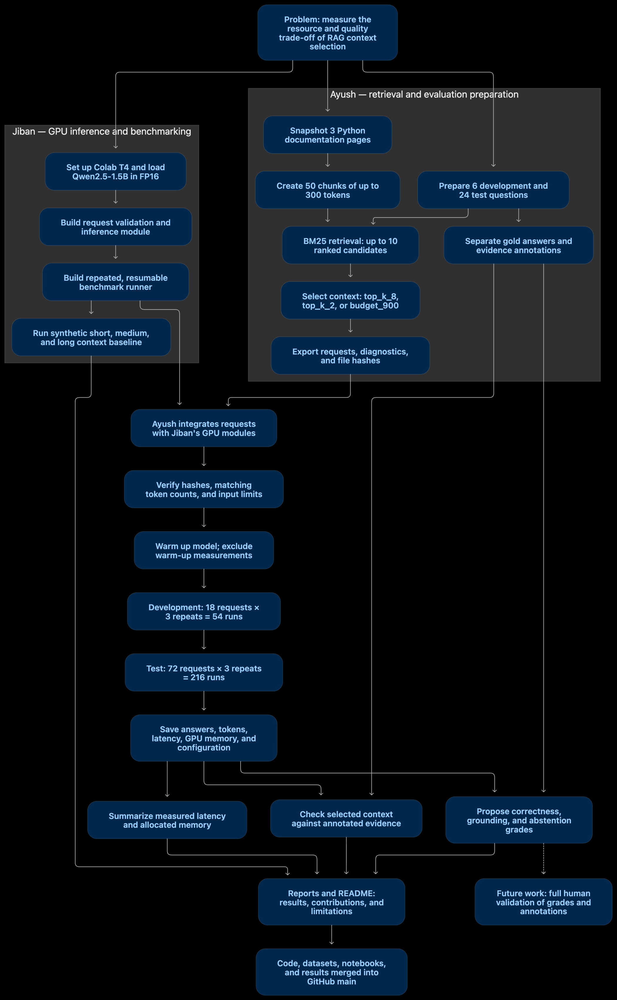

# ContextFit

**Evaluating how retrieved context affects RAG answer quality, generation latency, and GPU memory on an NVIDIA T4.**

Built by **Jibankrishna Patra (Jiban)** and **Ayush**.

## Overview

ContextFit compares three ways of selecting retrieved context for a self-hosted language model.

The project combines:

- Documentation processing and token-based chunking.
- BM25 retrieval.
- Fixed-count and token-budget context selection.
- GPU inference using Qwen2.5-1.5B-Instruct.
- Repeated, resumable benchmarking.
- Evidence availability checks and preliminary answer-quality evaluation.

**Implementation and GPU benchmarks are complete. Semantic answer grades remain assistant-proposed and have not undergone full human validation.**

## Problem Statement

RAG applications retrieve documents and provide them to a language model as supporting context.

Providing more context can preserve useful evidence, but increases the amount of input the model processes. Providing less context can reduce resource usage, but may remove information needed to answer correctly.

For a self-hosted assistant running on limited GPU hardware, this creates a practical question:

> How does reducing retrieved context affect generation latency, GPU memory, evidence availability, and answer quality?

ContextFit investigates this question using the same model, hardware, questions, and generation settings across three context-selection policies.

This is an application-level GPU inference experiment. It does not implement custom CUDA kernels or train a new language model.

## Goals

1. Build a reproducible retrieval-to-generation pipeline.
2. Compare fixed-count retrieval with token-budget context selection.
3. Measure input tokens, output tokens, generation latency, and peak allocated GPU memory.
4. Check whether selected context retains the annotated evidence needed to answer.
5. Inspect correctness, grounding, abstention, and citation behavior.
6. Preserve requests, configuration, and raw results for analysis.

## Practical Value and Use Cases

Potential applications include:

- Internal documentation assistants.
- Technical support assistants.
- Knowledge-base question answering.
- Resource-constrained, self-hosted RAG systems.

ContextFit provides measurements that can inform context-selection decisions. Reducing context is useful only when the resource benefit is acceptable alongside evidence retention and answer quality.

**This experiment does not establish production cost savings, increased serving capacity, or unchanged answer accuracy.** Those require additional evaluation.

## Project Status

| Component | Status |
|---|---|
| GPU inference and request validation | Implemented |
| Resumable benchmark runner | Implemented |
| Documentation processing and chunking | Implemented |
| BM25 retrieval | Implemented |
| Three context-selection policies | Implemented |
| Development and test request exports | Complete |
| Development benchmark | 54 measured generations completed |
| Test benchmark | 216 measured generations completed |
| Automated evidence checks | Complete against current annotations |
| Proposed semantic evaluation | Included |
| Full human validation of annotations and grades | Pending |

## Team Contributions

### Jiban — GPU Inference and Benchmark Infrastructure

Jiban built the GPU execution and measurement foundation.

Contributions:

- Set up and verified NVIDIA T4 inference in Google Colab.
- Loaded `Qwen/Qwen2.5-1.5B-Instruct` in FP16.
- Implemented context-based answer generation with citation and abstention instructions.
- Added request validation and source-marker checks.
- Enforced the experiment's input-token limit and output-token reservation.
- Measured generation latency, input/output tokens, and allocated GPU memory.
- Implemented repeated, sequential benchmark execution.
- Added per-attempt JSONL logging and resume behavior that skips completed jobs.
- Packaged inference, validation, and benchmarking into reusable Python modules.
- Ran the initial synthetic context-length experiment.

Primary artifacts:

- `src/contextfit/inference.py`
- `src/contextfit/benchmark.py`
- `src/contextfit/validation.py`
- `notebooks/ContextFit_01_GPU_Baseline.ipynb`

### Ayush — Retrieval, Context Selection, and Integrated Evaluation

Ayush built the retrieval and evaluation pipeline and connected it to the GPU infrastructure.

Contributions:

- Prepared snapshots of three Python documentation pages.
- Built 50 tokenizer-based document chunks.
- Implemented deterministic BM25 retrieval.
- Implemented `top_k_8`, `top_k_2`, and `budget_900`.
- Prepared development/test questions, expected answers, and sufficient evidence annotations with AI assistance.
- Kept expected answers and gold evidence separate from model inputs.
- Exported requests, diagnostics, and manifests with file hashes.
- Verified prompt-token counts between Windows and Colab.
- Integrated exported requests with Jiban's inference and benchmark modules.
- Ran development and test benchmarks on a Colab T4.
- Saved raw benchmark results.
- Added proposed grading artifacts, summary scripts, and failure analysis.

Primary artifacts:

- `src/contextfit/retrieval.py`
- `src/contextfit/context_policies.py`
- Preparation, validation, and export scripts under `scripts/`
- `data/processed/`
- `data/evaluation/`
- `data/requests/`
- `notebooks/ContextFit_02_RAG_Evaluation.ipynb`
- `results/contextfit_test_results.jsonl`
- Evaluation reports under `reports/`

### Contribution and Review Boundaries

Jiban owned GPU inference and measurement infrastructure. Ayush owned retrieval, context policies, and integrated evaluation execution.

The project used AI assistance during development and proposed grading. Full human validation of gold annotations and semantic grades is not claimed as completed work.

## System Workflow

1. Preserve and process documentation snapshots.
2. Create tokenizer-sized document chunks.
3. Retrieve candidates using BM25.
4. Select context using one of three policies.
5. Add source markers and format the model prompt.
6. Validate the full prompt against the input limit.
7. Generate an answer on the T4.
8. Save the answer, token counts, timing, memory, and configuration.
9. Compare evidence availability and preliminary answer-quality assessments.

Retrieval and context preparation run on the CPU. Model generation runs on the GPU.

The measured inference runs do not require an external LLM API.

## Project Flow



Expected answers and gold evidence are used for evaluation, not included in inference requests.

## Dataset

The corpus contains snapshots of Python 3.13 tutorial pages covering:

- Virtual environments and packages.
- Modules.
- Errors and exceptions.

### Corpus Statistics

| Property | Value |
|---|---:|
| Source documents | 3 |
| Total chunks | 50 |
| Maximum chunk length | 300 tokens |
| Development questions | 6 |
| Test questions | 24 |

Chunk lengths are measured using the project tokenizer.

### Test Question Composition

| Category | Questions |
|---|---:|
| Direct | 15 |
| Multi-evidence | 3 |
| Unanswerable from the corpus | 6 |

Development and test questions use the same document collection and share concepts. This is not a cross-domain generalization benchmark.

## Retrieval and Context Policies

BM25 uses:

- `k1 = 1.5`
- `b = 0.75`
- Consistent query/document tokenization.
- Deterministic ranking with stable tie handling.

Each question retrieves up to ten positive-scoring candidates. All policies select from the same ranked candidates.

| Policy | Behavior |
|---|---|
| `top_k_8` | Select the first eight candidates, or fewer if unavailable |
| `top_k_2` | Select the first two candidates, or fewer if unavailable |
| `budget_900` | Greedily include whole chunks in rank order when they fit the context and full-prompt limits; skip chunks that do not fit |

For `budget_900`, the context budget includes source markers but excludes system instructions and the question.

**The full prompt can therefore exceed 900 tokens while satisfying the 900-token context budget.**

## Model and Hardware

| Setting | Value |
|---|---|
| Model | `Qwen/Qwen2.5-1.5B-Instruct` |
| GPU | NVIDIA Tesla T4 on Google Colab |
| Observed GPU capacity | Approximately 14.56 GiB |
| Precision | FP16 |
| Attention implementation | SDPA |
| Decoding | Greedy, `do_sample=False` |
| Maximum generated tokens | 80 |
| Experiment total-token limit | 4,096 |
| Maximum formatted input | 4,016 tokens |
| Test Python version | 3.13.15 |
| Test PyTorch version | 2.11.0+cu130 |
| Test Transformers version | 5.18.0 |

The 4,096-token limit is a project setting, not the model's advertised maximum context length.

The saved configuration does not identify a pinned model revision, limiting exact reproducibility.

## Benchmark Methodology

| Split | Questions | Policies | Repetitions | Measured generations |
|---|---:|---:|---:|---:|
| Development | 6 | 3 | 3 | 54 |
| Test | 24 | 3 | 3 | 216 |

Warm-up runs were excluded from reported measurements. Jobs ran sequentially in a shuffled order using seed 42.

Generated text was identical across all three repetitions for every test question-policy pair. Repetitions provide timing observations, not independent answer-quality samples.

### Measurement Scope

Generation timing:

- Includes prefill and decoding inside `model.generate`.
- Uses GPU synchronization around the measured operation.
- Excludes retrieval, tokenization, model loading, input transfer, and output text decoding.

Memory measurements:

- Use PyTorch allocated-memory metrics.
- Include model tensor allocations.
- Do not represent total GPU usage or reserved memory.

## Test Benchmark Results

The medians below pool the 72 measured generations for each policy.

| Policy | Median input tokens | Median output tokens | Median generation time | Maximum peak allocated memory | Runs reaching 80-token cap |
|---|---:|---:|---:|---:|---:|
| `top_k_8` | 2,235.0 | 36.0 | 2.335 s | 3.651 GiB | 9/72 |
| `top_k_2` | 627.5 | 43.5 | 1.691 s | 2.974 GiB | 6/72 |
| `budget_900` | 910.5 | 51.0 | 2.147 s | 3.044 GiB | 9/72 |

Relative to `top_k_8`:

- `top_k_2` had approximately **27.6% lower observed median generation time**.
- `budget_900` had approximately **8.1% lower observed median generation time**.
- Both reduced-context policies had lower maximum peak allocated memory.

Output lengths differed across policies. These results do not isolate input length as the only cause of timing differences or establish a universal speedup.

The evaluation summary also reports `median_of_question_median_seconds`: the median of 24 within-question medians. This differs from the pooled medians above.

## Preliminary Answer-Quality Evaluation

**These semantic grades are assistant-proposed and pending full human validation. Gold annotations also await full human review.**

Quality is counted once per distinct question-policy answer.

| Policy | Full annotated evidence available | Fully correct | Partially correct | Incorrect | Appropriate abstention |
|---|---:|---:|---:|---:|---:|
| `top_k_8` | 18/18 | 7/18 | 6/18 | 5/18 | 4/6 |
| `top_k_2` | 16/18 | 6/18 | 4/18 | 8/18 | 3/6 |
| `budget_900` | 17/18 | 7/18 | 3/18 | 8/18 | 4/6 |

Interpretation:

- Evidence availability is checked mechanically against annotated sufficient evidence sets.
- Correctness is assessed on the 18 answerable questions.
- Abstention is assessed on the six unanswerable questions.
- Both 4/6 abstention counts include a borderline grading decision documented in the evaluation artifacts.
- None of the 72 distinct test answers contained a source citation.

Evidence presence does not guarantee correct generation. Missing citations do not by themselves prove an answer is unsupported.

See:

- [Evaluation rubric](reports/EVALUATION_RUBRIC.md)
- [Per-answer review](reports/TEST_ANSWER_REVIEW.md)
- [Proposed summary](reports/evaluation_summary_proposed.md)
- [Results report](reports/RESULTS.md)

## Findings

### Resource Use

Both reduced-context policies used fewer input tokens and had lower observed median generation time and maximum peak allocated memory.

### Evidence Retention

`top_k_2` retained full annotated evidence for 16 of 18 answerable questions. `budget_900` retained it for 17.

Reducing context can remove necessary evidence.

### Generation Quality

Proposed review identified incorrect answers even when the annotated evidence was present.

Retrieval success alone does not guarantee a correct final answer.

### Output Length and Citations

Some answers visibly ended before completing the requested explanation or steps. Reaching 80 tokens alone does not prove truncation in every case.

No distinct test answer emitted a source citation despite the prompt instruction.

### Interpretation

The experiment supports further investigation of context selection. It does not establish that smaller context preserves answer accuracy.

## Initial Synthetic Experiment

Before the integrated RAG benchmark, a refund-window question was evaluated with fixed supporting evidence and increasing repetitive irrelevant context.

Each input used two warm-up runs and five timed repetitions.

| Context | Input tokens | Output tokens | Median generation time | Peak allocated memory | Correct fact | Citation |
|---|---:|---:|---:|---:|---|---|
| Short | 80 | 17 | 0.662 s | 2.891 GiB | Yes | Yes |
| Medium | 865 | 20 | 0.950 s | 3.018 GiB | Yes | Yes |
| Long | 2,685 | 16 | 1.762 s | 3.809 GiB | Yes | No |

This is a single-question exploratory experiment, not a general answer-quality benchmark.

Its raw files were saved separately in Google Drive. The committed test-results file belongs to the integrated Python-documentation benchmark.

## Repository Structure

| Path | Purpose |
|---|---|
| `src/contextfit/inference.py` | Prompt preparation, generation, and GPU measurement |
| `src/contextfit/benchmark.py` | Repeated execution, logging, and resume behavior |
| `src/contextfit/validation.py` | Request validation |
| `src/contextfit/retrieval.py` | BM25 retrieval |
| `src/contextfit/context_policies.py` | Context selection and token-limit checks |
| `scripts/` | Preparation, validation, export, and summary utilities |
| `data/raw/` | Source snapshots and metadata |
| `data/processed/` | Documents, chunks, and chunk manifest |
| `data/evaluation/` | Gold annotations, proposed grades, and grading manifest |
| `data/requests/` | Requests, diagnostics, and export manifests |
| `notebooks/ContextFit_01_GPU_Baseline.ipynb` | Initial GPU baseline |
| `notebooks/ContextFit_02_RAG_Evaluation.ipynb` | Integrated Colab evaluation |
| `results/contextfit_test_results.jsonl` | Raw test-run records |
| `reports/` | Findings, grading rules, and answer review |
| `docs/mermaid-diagram.png` | Complete project flow diagram |

## Local Setup

Document preparation, retrieval, and evaluation summaries do not require a GPU. Model generation runs in Colab.

### Clone the Repository

```bash
git clone https://github.com/Jiban243/ContextFit.git
cd ContextFit
```

### macOS

The original Mac development environment used Python 3.11.

```bash
python3 -m venv .venv
source .venv/bin/activate
python -m pip install -r requirements-retrieval.txt
```

### Windows PowerShell

```powershell
py -m venv .venv
.\.venv\Scripts\Activate.ps1
python -m pip install -r requirements-retrieval.txt
```

If the environment already exists, activate it instead of creating it again.

A warning that PyTorch is unavailable is expected in a tokenizer-only local environment. GPU generation requires PyTorch in Colab.

## Validate and Summarize Existing Artifacts

From the project root:

```bash
python scripts/check_evaluation.py
python scripts/summarize_evaluation.py
```

The evaluation check validates structure, IDs, and evidence references. It does not validate answer semantics.

The summary script reads existing proposed grades. It does not run the model or independently judge answers.

### Export Requests

```bash
python scripts/export_requests.py
```

This creates a new timestamped folder under `data/requests/` containing requests, diagnostics, and a manifest.

Expected answers and gold evidence are excluded from inference requests.

### Rebuild the Corpus

```bash
python scripts/prepare_documents.py
python scripts/build_chunks.py
```

Rebuilding from live documentation can change the corpus. Changes to documents or chunks require rechecking annotations and regenerating dependent artifacts.

Use committed snapshots and original exports when tracing the reported experiment.

## GPU Evaluation in Colab

Open:

`notebooks/ContextFit_02_RAG_Evaluation.ipynb`

Select a GPU runtime. Verify that the assigned GPU is a T4 when reproducing the reported hardware configuration.

The evaluation uses these Google Drive locations:

| Artifact | Drive location |
|---|---|
| Python modules | `MyDrive/ContextFit/evaluation_src/contextfit/` |
| Request exports | `MyDrive/ContextFit/requests/<export_folder>/` |
| Benchmark output | `MyDrive/ContextFit/results/<run_folder>/` |

The notebook uses `/content/contextfit_drive` as its Drive mount point.

Workflow:

1. Upload the inference, benchmark, and validation modules.
2. Upload requests, diagnostics, and the export manifest.
3. Verify file hashes and prompt-token counts.
4. Load the model and tokenizer.
5. Run warm-up generations.
6. Run the benchmark.
7. Preserve raw results and configuration.

A runtime restart requires rerunning setup and model loading.

### Resume Behavior

Completed jobs are skipped when the same output file, request contents, and configuration are reused.

After a runtime reset, explicitly select the previous result directory to resume. Starting a new directory creates a separate run.

Recovery from a partially written JSONL line is not implemented.

Do not combine measurements made with different generation settings into one policy comparison.

## Request Format

The retrieval pipeline produces records such as:

```json
{
  "question_id": "q001",
  "policy": "top_k_2",
  "question": "Within how many days can a customer request a refund?",
  "context": "[doc1] Customers can request a refund within 14 days.",
  "source_ids": ["doc1"]
}
```

Expected answers and sufficient evidence annotations remain outside model requests.

The exporter's prompt formatting and the inference module must stay aligned for token-count checks to remain meaningful.

## Human Review

The current answer-quality summary is preliminary.

Human-review fields and a review report are included for future validation. These fields should only be completed after examining the question, generated answer, expected answer, and supplied evidence.

Once all required records have actually been reviewed:

```bash
python scripts/summarize_evaluation.py --human
```

This command checks that review fields are populated and valid. It cannot verify that judgments are correct.

Gold annotation review is separate from generated-answer review.

## Reproducibility and Limitations

- The corpus contains three documentation pages.
- The test set contains 24 manually authored questions.
- Semantic grades and gold annotations are not fully human-validated.
- The grading rubric was formalized after inspecting test outputs.
- The model revision was not pinned.
- Local and Colab dependency versions differed; exported prompt-token counts were checked for agreement.
- Output lengths vary across policies.
- Three repetitions do not establish robust statistical significance.
- Timing measures generation, not end-to-end application latency.
- Memory measures PyTorch allocations, not total GPU usage.
- Concurrent serving, time to first token, and production throughput were not evaluated.
- No monetary savings were measured.
- File hashes describe exact bytes; Git line-ending conversion can change hashes without changing parsed JSON.
- Changes informed by this test set require a new held-out evaluation or an explicit exploratory label.

## Future Work

- Complete human review of annotations and proposed grades.
- Expand the document collection and evaluation set.
- Improve citation compliance.
- Investigate output allowances and incomplete answers.
- Compare additional retrieval and context-selection approaches.
- Measure end-to-end latency and concurrent serving behavior.
- Pin model/tokenizer revisions and preserve a complete environment snapshot.

## Authors

- **Jibankrishna Patra (Jiban):** GPU inference, validation, benchmark infrastructure, and initial baseline experiments.
- **Ayush:** Retrieval, context policies, dataset preparation, integrated T4 evaluation, and proposed grading workflow.